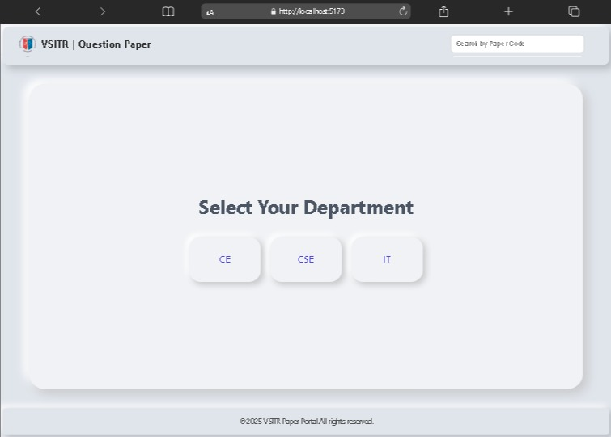
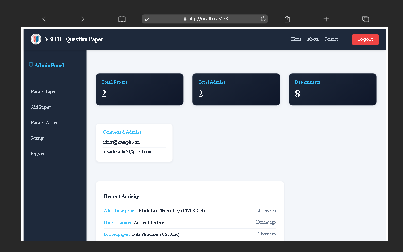

# VSITR Paper Portal

A web application for VSITR Collage where professor can upload question papers and students can download them. The system is devided into three parts: **Admin**, **Client**, and **Server**.

---

##Features

- **Admin (professors)** can upload papers.
- **Clients (Students)** can download papers department-wise and semester-wise.
- Secure login for admins.
- organized papers by department -> semester -> subject.
- Easy-to-use interface for non-technical users.

---

## Project Structure

vsitr-paper/
|--admin/ #Admin portal (React, Firebase Auth, Firestore, Hosting)
|--client/ #Client frontend(React)
|-- README.md #Documentation

---

## Teach Stack

- **Frontend (Admin & Client):** React.js, css, Firebase
- **Database:** Firestore database
- **Version Control:** git & github

---

## Setup Instruction

1. **Clone the repository**
   ```
   bash https://github.com/Bluegriphen/vsitr-paper.git \
   cd vsitr-paper
   ```
2. Install dependencies
   For Admin:
   cd admin && npm install
   FOR Client:
   cd ../client && npm install

3. Run the applications
   Admin:
   cd admin && npm run dev
   client:
   cd client && npm run dev

## Screenshots

Home 
Admin Page: 

## Author

    Priyanka Solanki - Developer of VSITR Paper Portal and Admin portal.
